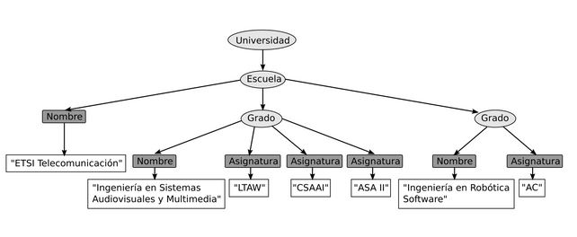

## Ejercicio 1
Dado este documento descrito en SGML, usando el tipo de documento urjc_ml definido en el fichero urjc_ml.dtd

* a) Explica para qué sirve la primera línea del documento y por qué es necesaria
    * La primera linea del documento es un lenguaje propio de marcado. Esta linea sirve para:
        * permitirnos crear nuestro propio lenguaje de marcado adaptado a nuestras necesidades.
        * Así, especifica la sintáxis de las etiquetas y nos permite definir sus nombres y su estructura como nosotros queramos. El fichero donde definimos qué etiquetas son válidas y su sintáxis, se denomina definición del tipo de documento y su extensión es .dtd (DTD = Document Type Definition)
    * Ademas, Usando SGML escribimos la definición de nuestro lenguaje en el fichero "urjc_ml.dtd", es decir, tenemos que saber que la definición de las etiquetas del lenguaje OBML está en ese fichero
* b) Si se omitiese esta línea, ¿Qué piensas que ocurriría?
    * No podríamos crear nuestro propio leguaje de marcado
* c) Sin conocer el contenido del fichero urjc_ml.dtd, ¿el documento es sintácticamente correcto?
    * Si, ya que termina en dtd.
* d) ¿Qué hace la tercera línea?
    * Es un comentario
* e) ¿Cuantas etiquetas de apertura hay? ¿Cuantas de cierre?

    |Etiquetas|   numero     |
    |---------|--------------|
    |apertura |      10      |
    |cierre   |       9      |
* f) Dibuja el diagrama de contenedores de este documento
    * Llamamos diagrama de contenedores o diagrama de cajas a la representación de la estructura, asi unos elementos contienen a otros elementos.

* g) Dibuja la estructura en árbol que define este documento
    
## Ejercicio 2

Este arbol representa la estructura del tipo de documento universidad, que está definido en el archivo llamado universidad.dtd. Los nombres de las etiquetas de cada elemento del árbol están escritos en los nodos. Estos nombres son válidos y se encuentra definidos dentro del documento DTD

 

* a) Escribe el documento en SGML que representa esa estructura
* b) ¿Cuantos elementos hay en total?
* c) ¿Cuantos elementos terminales hay?. Indica sus valores
* d) ¿Cuantos elementos no terminales hay?. Indica cuántos hay en cada nivel
* e) ¿Cuantos elementos hay en el nivel 5?.Indica sus nombres
